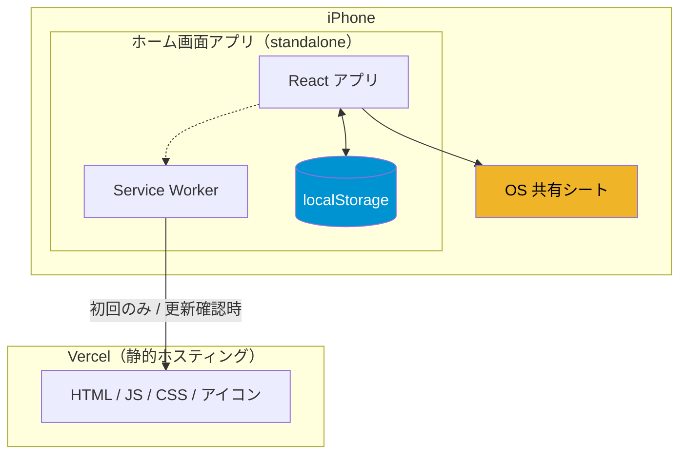
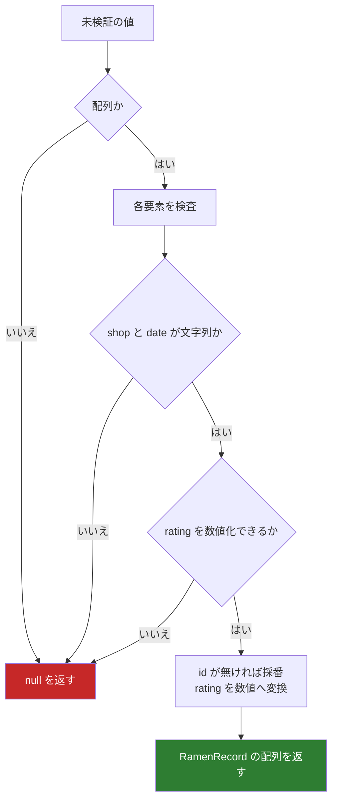
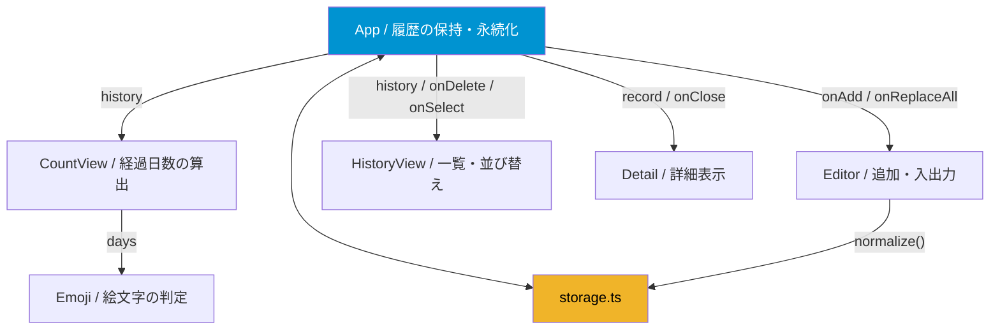
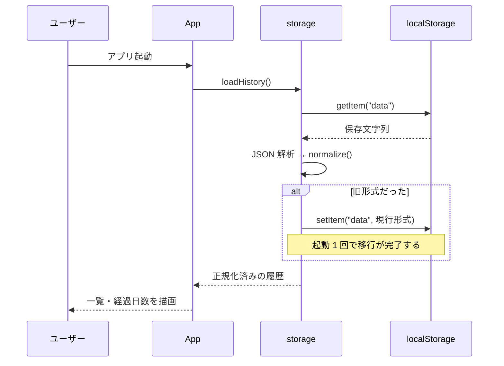
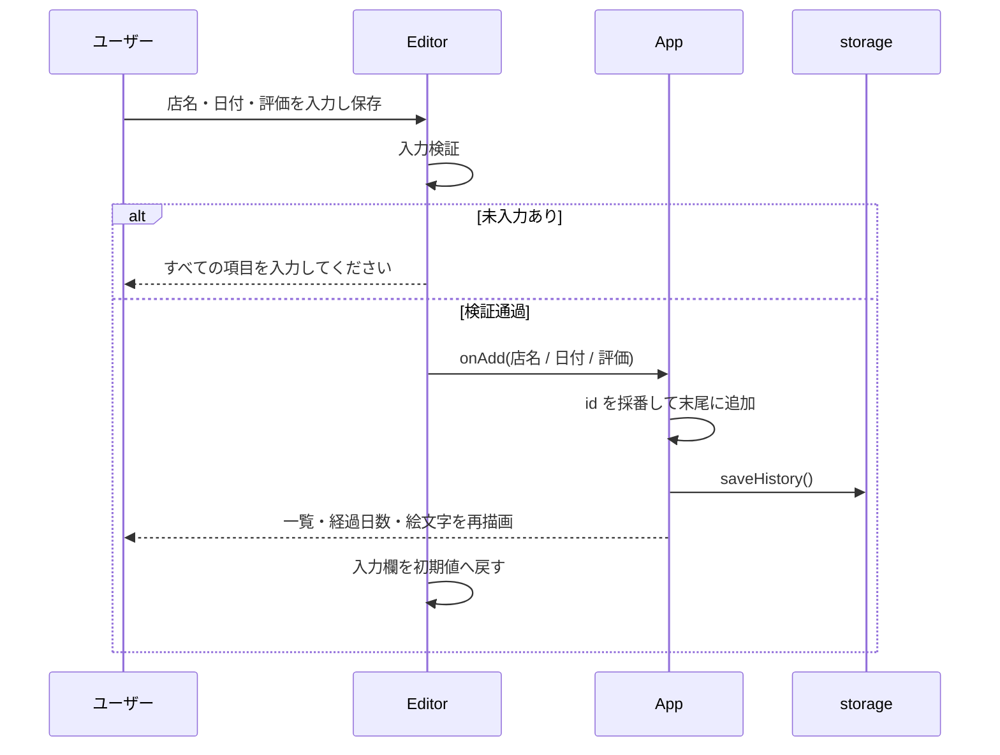
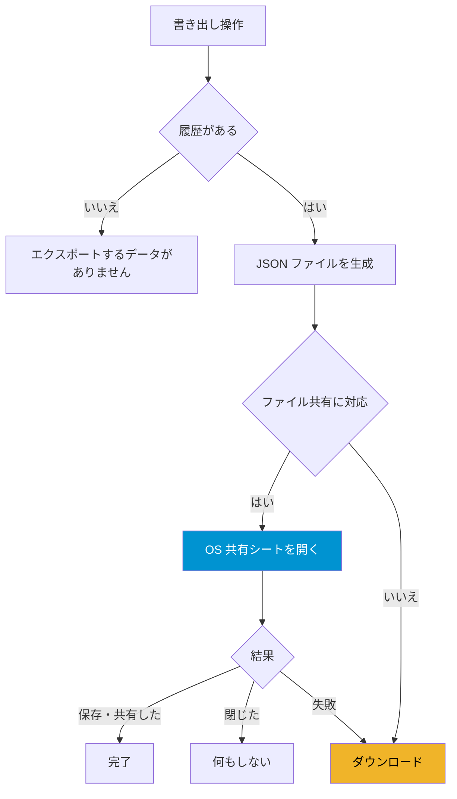
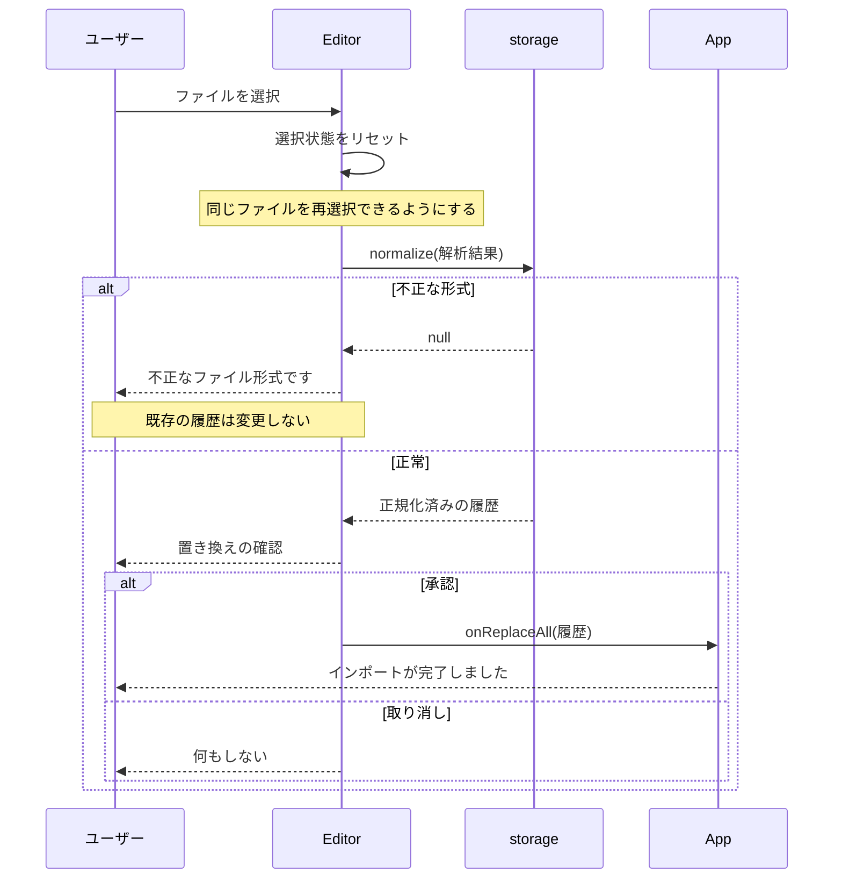

# ラーメン履歴 詳細設計書

My Ramen History の内部設計を定義する。機能の外部仕様は `ラーメン履歴-仕様書.md` を参照。

| 項目 | 内容 |
| --- | --- |
| 対象システム | My Ramen History |
| 作成日 | 2026-08-20 |
| 関連文書 | ラーメン履歴-仕様書.md |

---

## 1. システム構成

バックエンドを持たず、静的ファイルの配信のみで成立する。記録は端末内の localStorage に閉じ、ネットワークを越えない。



初回読み込み以降、アプリの動作に通信は不要となる。Service Worker が全アセットを事前キャッシュするため、機内モードでも起動する。

### 1.1 技術スタック

| 領域 | 採用技術 | バージョン | 選定理由 |
| --- | --- | --- | --- |
| UI | React | 19.1 | — |
| 言語 | TypeScript | 5.8 | strict、未使用変数の検出を有効化 |
| ビルド | Vite | 7.0 | — |
| UI 部品 | MUI | 7.3 | 日付選択と ★ 評価をそのまま利用できる |
| 日付処理 | Day.js | 1.11 | MUI の日付選択アダプタと揃える |
| PWA | vite-plugin-pwa | 1.3 | manifest 生成と Service Worker 生成を担う |
| 配信 | Vercel | — | 静的配信のみで足りるため |

外部フォント、解析ツール、その他のサードパーティ通信は持たない。これは NFR-04（オフライン動作）の前提である。

### 1.2 ディレクトリ構成

```
src/
├── main.tsx              エントリポイント
├── App.tsx               状態の保持と各機能の結線
├── types.ts              データ型定義
├── storage.ts            永続化と正規化
├── index.css             基盤スタイル・デザイントークン
├── App.css               レイアウト
└── components/
    ├── CountView.tsx     経過日数の算出と表示
    ├── Emoji.tsx         状態絵文字の判定と表示
    ├── Editor.tsx        記録追加・エクスポート・インポート
    ├── HistoryView.tsx   履歴一覧
    └── Detail.tsx        記録の詳細ダイアログ
public/
├── icon.svg              アイコン原本
├── pwa-192.png           manifest 用
├── pwa-512.png           manifest 用（maskable 兼用）
├── apple-touch-icon.png  iOS ホーム画面用（180px）
└── favicon-32.png        ブラウザタブ用
```

---

## 2. データ設計

### 2.1 型定義

`src/types.ts` に単一の型を定義し、全コンポーネントがこれを参照する。

| フィールド | 型 | 内容 |
| --- | --- | --- |
| `id` | `string` | 一意な識別子。UUID |
| `shop` | `string` | 店名 |
| `date` | `string` | 来訪日。`YYYY-MM-DD` 固定 |
| `rating` | `number` | 評価。0.5〜5.0 |

**`date` を文字列で保持する理由。** `YYYY-MM-DD` に固定することで、辞書順の比較が日付順の比較と一致する。最新日付の抽出と一覧の並び替えを、日付オブジェクトへの変換なしに行える。

**`rating` を数値で保持する理由。** 表示側で毎回 `Number()` に通す必要をなくし、型として不正値を排除する。

### 2.2 識別子の採番

`crypto.randomUUID()` を用いる。これはセキュアコンテキスト（https / localhost）でのみ利用できるため、利用できない環境ではタイムスタンプと乱数の組み合わせにフォールバックする。

### 2.3 永続化

| 項目 | 内容 |
| --- | --- |
| 保存先 | localStorage |
| キー | `data` |
| 形式 | 記録の配列を JSON 直列化した文字列 |

保存キーは旧バージョンから変更していない。変更すると既存利用者の記録が読めなくなるためである。

### 2.4 正規化とマイグレーション

`storage.ts` の `normalize()` が、外部由来の値を検証しつつ現行形式へ変換する。localStorage からの読み込みとインポートの両方がこの関数を通る。**アプリ内部に不正な形の記録が入り込む経路は存在しない。**



1 件でも条件を満たさない要素があれば、そのデータ全体を不正として `null` を返す。部分的な取り込みは行わない。

**移行の書き戻し。** `loadHistory()` は、正規化の結果が元の文字列と異なる場合に限り localStorage へ書き戻す。旧形式の利用者は起動 1 回で現行形式へ移行し、以降この比較は成立しない。

---

## 3. コンポーネント設計

### 3.1 構成



状態を持つのは `App` と `Editor` のみで、他は受け取った値を表示するだけである。

### 3.2 各コンポーネント

#### App

履歴を保持し、永続化と各機能の結線を担う。

| 状態 | 型 | 内容 |
| --- | --- | --- |
| `history` | `RamenRecord[]` | 履歴の全体 |
| `selected` | `RamenRecord \| null` | 詳細表示中の記録 |

`commit()` が状態更新と保存を一体で行う。**履歴を変更する経路はこの関数のみ**とし、状態と localStorage が食い違う余地をなくしている。

| ハンドラ | 処理 |
| --- | --- |
| `handleAdd` | 識別子を採番して末尾に追加し `commit()` |
| `handleReplaceAll` | 履歴全体を置き換えて `commit()` |
| `handleDelete` | 識別子一致で除外して `commit()`。削除対象が詳細表示中なら `selected` を解除 |

#### CountView

経過日数を算出し、履歴の状態に応じた文言を表示する。算出結果は `Emoji` にも渡す。

| props | 型 |
| --- | --- |
| `history` | `RamenRecord[]` |

#### Emoji

経過日数から絵文字と説明文を決定する。**自身ではデータを読まない。**

| props | 型 |
| --- | --- |
| `days` | `number \| null` |

#### Editor

記録の追加、エクスポート、インポートを担う。

| 状態 | 型 | 初期値 |
| --- | --- | --- |
| `open` | `boolean` | `false` |
| `shop` | `string` | `""` |
| `date` | `Dayjs \| null` | 本日 |
| `rating` | `number \| null` | `2.5` |

| props | 型 |
| --- | --- |
| `onAdd` | `(record: Omit<RamenRecord, "id">) => void` |
| `onReplaceAll` | `(records: RamenRecord[]) => void` |

識別子の採番は `App` の責務とするため、`onAdd` は `id` を除いた形で渡す。

#### HistoryView

履歴を日付降順で並べ替えて表示する。並べ替えは複製に対して行い、受け取った配列は変更しない。

| props | 型 |
| --- | --- |
| `history` | `RamenRecord[]` |
| `onDelete` | `(id: string) => void` |
| `onSelect` | `(record: RamenRecord) => void` |

#### Detail

記録の詳細をダイアログで表示する。`record` が `null` でないことをもって開いた状態とする。開閉フラグを別に持たないため、状態の不整合が起きない。

| props | 型 |
| --- | --- |
| `record` | `RamenRecord \| null` |
| `onClose` | `() => void` |

---

## 4. 状態管理方針

**localStorage を読むのは `App`（起動時）と `Editor`（エクスポート時）に限る。** 表示に必要な値はすべて props を通じて上から流す。

この方針は、以前の実装で発生していた不具合への対処として定めた。

| | 以前の実装 | 現在の実装 |
| --- | --- | --- |
| 絵文字の取得元 | `Emoji` が localStorage を直接読む | `CountView` から props で受け取る |
| 保存後の更新 | 画面全体を再読み込みして反映 | React の再描画で反映 |

以前は `Emoji` が独自にデータを読んでいたため、記録を追加しても絵文字が古いままとなり、保存処理の末尾で画面全体を再読み込みしていた。これは iOS のホーム画面アプリではアプリが再起動したように見えるため、PWA として成立させるうえで解消が必須だった。データの取得元を一本化することで、再読み込みは不要になった。

---

## 5. 主要処理フロー

### 5.1 起動とマイグレーション



localStorage 自体にアクセスできない場合（プライベートブラウズ等）や解析に失敗した場合は、空の履歴として扱い、起動は継続する。

### 5.2 記録の追加



### 5.3 エクスポート

出力方法を実行環境に応じて切り替える。



**共有シートを優先する理由。** iOS のホーム画面アプリではダウンロード操作が機能しない。この分岐がない場合、iPhone 利用者はバックアップを取る手段を一切持たないことになる。記録が端末内にしか存在しない本アプリにおいて、これはデータ保全の要となる。

ユーザーが共有シートを閉じた場合は中断とみなし、ダウンロードへの切り替えは行わない。それ以外の失敗時のみダウンロードへ退避する。

### 5.4 インポート



---

## 6. ロジック詳細

### 6.1 経過日数の算出

1. 履歴が空なら `null` を返す。
2. `date` の辞書順最大値を最新来訪日とする（`YYYY-MM-DD` 固定のため辞書順と日付順が一致する）。
3. 本日と最新来訪日をそれぞれ日の始まりに丸め、その差を日数で返す。

日の始まりへ丸めることで、実行時刻によって結果が変わらない。前日の夜に食べた記録は、翌朝の実行でも常に 1 日と算出される。

### 6.2 表示文言の分岐

| 条件 | 表示 |
| --- | --- |
| `days === null` | まだ記録がありません |
| `days <= 0` | 今日ラーメンを食べました |
| それ以外 | ラーメンに行ってから **N日** が経過しました |

`0` ではなく 0 以下で判定するのは、未来日付が記録された場合に負数となるためである。

### 6.3 絵文字の判定

| 条件 | 絵文字 | 説明 |
| --- | --- | --- |
| `days === null` | ❓ | 履歴が見つかりません |
| `days < 3` | 🍜 | 最近食べたね（余裕） |
| `days < 7` | 🙂 | まだ大丈夫 |
| `days < 14` | 😢 | そろそろ行っておいたほうが良いかも |
| それ以外 | 😭 | 禁断症状（至急ラーメン） |

### 6.4 一覧の並び替え

`date` の辞書順降順で並べ替える。同日の記録間の順序は保証しない。

---

## 7. PWA 設計

### 7.1 manifest

| 項目 | 値 | 意図 |
| --- | --- | --- |
| `name` | My Ramen History | — |
| `short_name` | ラーメン履歴 | ホーム画面のアイコン名 |
| `display` | `standalone` | ブラウザ UI を表示しない |
| `orientation` | `portrait` | 縦向きに固定 |
| `start_url` / `scope` | `/` | — |
| `theme_color` / `background_color` | `#fce2c4` | 起動時の画面と本体の背景を一致させ、継ぎ目をなくす |

アイコンは 192px と 512px を登録し、512px は `maskable` としても登録する。アイコン全面が背景で塗られているため、円形などに切り抜かれても欠けない。

### 7.2 Service Worker

`vite-plugin-pwa` の `generateSW` により生成する。ビルド成果物（JS / CSS / HTML / 画像）をすべて事前キャッシュする。

外部ホストへのリクエストを持たないため、実行時キャッシュの設定は不要である。事前キャッシュのみでオフライン動作が成立する。

更新方式は自動更新とし、新しい版を検出した時点で入れ替える。ユーザーへの操作要求はない。

### 7.3 iOS 固有の対応

| 対応 | 目的 |
| --- | --- |
| `apple-touch-icon`（180px PNG） | iOS はホーム画面アイコンに SVG を使えない |
| `apple-mobile-web-app-capable` | iOS 17.4 未満で全画面起動させる |
| `apple-mobile-web-app-title` | ホーム画面での表示名 |
| `viewport-fit=cover` とセーフエリア余白 | ノッチとホームインジケータを避ける |
| 共有シートによるエクスポート | 5.3 参照 |

### 7.4 更新の到達

配信側で Service Worker と manifest にキャッシュ無効化を指定する。

| パス | ヘッダ |
| --- | --- |
| `/sw.js` | `Cache-Control: no-cache` |
| `/manifest.webmanifest` | `Cache-Control: no-cache` |

この指定がない場合、古い Service Worker が CDN に残り続け、更新が端末に到達しなくなる。

---

## 8. スタイル設計

### 8.1 方針

MUI のコンポーネントと、アプリ固有のレイアウト用 CSS の 2 系統に限る。以前は Tailwind を含む 3 系統が混在していたが、実使用が 1 箇所のみだったため依存ごと除去した。

### 8.2 デザイントークン

`index.css` の `:root` に定義し、各所から参照する。

| トークン | 値 | 用途 |
| --- | --- | --- |
| `--bg` | `#fce2c4` | 画面背景 |
| `--surface` | `#fffaf3` | カード背景 |
| `--text` | `#3a2a1a` | 本文 |
| `--text-muted` | `#8a7a6a` | 補助文字 |
| `--accent` | `#0093d1` | 強調 |

### 8.3 フォント

外部フォントを読み込まず、OS 標準のフォントを使う。iOS ではヒラギノ角ゴシックが適用される。

これは NFR-04 の要件による。外部フォントを参照する限り、オフライン時に本文の描画が崩れる。

### 8.4 一覧のレイアウト

以前は表組みで実装していたが、最小幅の指定により 375px 幅で横スクロールが発生していた。カード形式に変更し、店名が長い場合は省略記号で切り詰める。

### 8.5 セーフエリア

`body` に各方向のセーフエリア余白を与える。全画面起動時にノッチやホームインジケータと内容が重ならない。

---

## 9. エラー処理方針

利用者が対処できる事象のみ通知し、対処できない内部事象は握り潰して動作を継続する。

| 事象 | 処理 | 通知 |
| --- | --- | --- |
| localStorage にアクセスできない | 空の履歴として起動を継続 | なし |
| 保存データの解析に失敗 | 空の履歴として起動を継続 | なし |
| 保存に失敗（容量超過等） | 状態のみ更新 | 容量不足の可能性とエクスポートを案内 |
| 入力が未完了 | 登録しない | すべての項目を入力してください |
| インポートの形式が不正 | 既存の履歴を維持 | 不正なファイル形式です |
| インポートの読み込みに失敗 | 既存の履歴を維持 | ファイルの読み込みに失敗しました |
| エクスポート対象が空 | 何もしない | エクスポートするデータがありません |
| 共有シートを閉じた | 何もしない | なし |

---

## 10. ビルドとデプロイ

| コマンド | 内容 |
| --- | --- |
| `npm run dev` | 開発サーバー |
| `npm run build` | 型検査 → 本番ビルド。型エラーがあれば成果物を生成しない |
| `npm run preview` | 本番ビルドの確認。Service Worker はこちらでのみ動作する |
| `npm run lint` | 静的解析 |

デプロイは `npx vercel --prod` による。

### 10.1 成果物

| 項目 | 値 |
| --- | --- |
| JavaScript | 617KB（gzip 193KB） |
| 事前キャッシュ | 15 ファイル / 629KB |

JavaScript の大半は MUI が占める。事前キャッシュにより初回のみの転送となるため、現時点では分割を行っていない。

### 10.2 アイコンの生成

原本は `public/icon.svg`。ここから 192 / 512 / 180 / 32 の PNG を書き出して `public/` に配置する。iOS のホーム画面アイコンは SVG を受け付けないため、PNG が必須となる。

---

## 11. 設計判断の記録

| 判断 | 理由 |
| --- | --- |
| バックエンドを持たない | 個人の記録に閉じており、共有も同期も要件にない。運用コストと個人情報の預かりを同時に回避できる |
| 記録に識別子を付与する | 削除を配列位置で行うと、並び替えや絞り込みを追加した時点で別の記録が消える。拡張予定に並び替えが含まれるため、データが蓄積する前に導入した |
| 表示側でデータを読まない | 取得元が複数あると更新の取りこぼしが起きる。実際に絵文字の更新漏れとして表面化していた |
| 画面の再読み込みをやめた | ホーム画面アプリではアプリの再起動に見える。状態を一本化したことで不要になった |
| エクスポートで共有シートを優先する | iOS のホーム画面アプリではダウンロードが機能せず、バックアップ手段が失われる |
| 外部フォントを使わない | オフライン動作の要件と両立しない |
| Tailwind を除去した | 実使用が 1 箇所のみで、styling の系統が 3 つに分かれる不利益が上回った |
| 保存キーを変更しない | 変更すると既存利用者の記録が読めなくなる |

---

## 12. テスト観点

| 区分 | 観点 |
| --- | --- |
| データ移行 | 旧形式（識別子なし・評価が文字列）を読み込み、内容が保持されたまま現行形式へ変換されること |
| 正規化 | 配列でない値、必須項目を欠く要素、数値化できない評価を含むファイルを拒否すること |
| 追加 | 追加後、一覧・経過日数・絵文字が画面の再読み込みなしに更新されること |
| 追加 | 店名の前後の空白が除去されること。空白のみの店名を拒否すること |
| 削除 | 一覧を並び替えた状態で、意図した記録が削除されること |
| 削除 | 詳細表示中の記録を削除した際、ダイアログが閉じること |
| 経過日数 | 実行時刻によらず同じ日数が算出されること |
| 経過日数 | 履歴が空のとき、日数を含む文言が表示されないこと |
| 絵文字 | 境界値（0 / 2 / 3 / 6 / 7 / 13 / 14 日）で正しく切り替わること |
| インポート | 取り消した場合に既存の履歴が変更されないこと |
| インポート | 同じファイルを続けて選択できること |
| エクスポート | iOS のホーム画面アプリで共有シートが開き、ファイルを保存できること |
| 表示 | 375px 幅で横スクロールが発生しないこと |
| 表示 | 長い店名が省略表示され、レイアウトが崩れないこと |
| PWA | ホーム画面から全画面で起動すること |
| PWA | 機内モードで起動し、全機能が動作すること |
| PWA | 再デプロイ後、再インストールなしで更新が反映されること |
